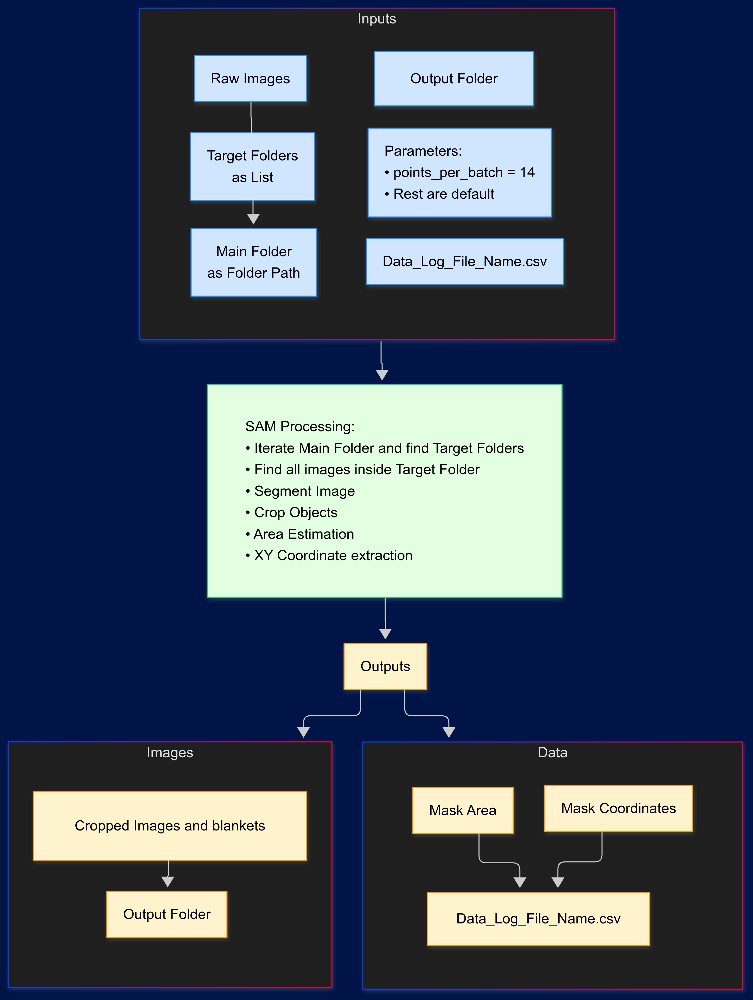
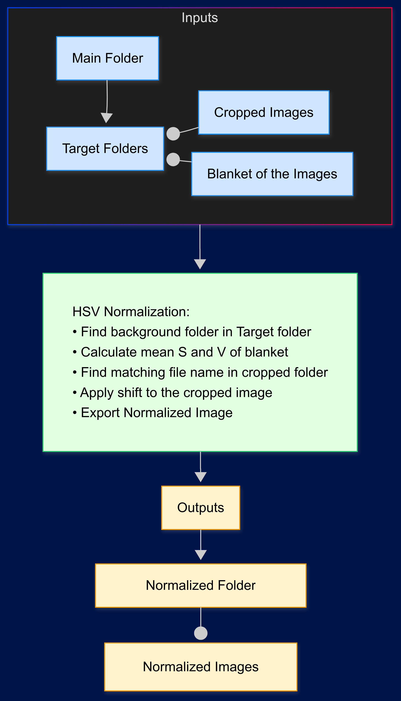
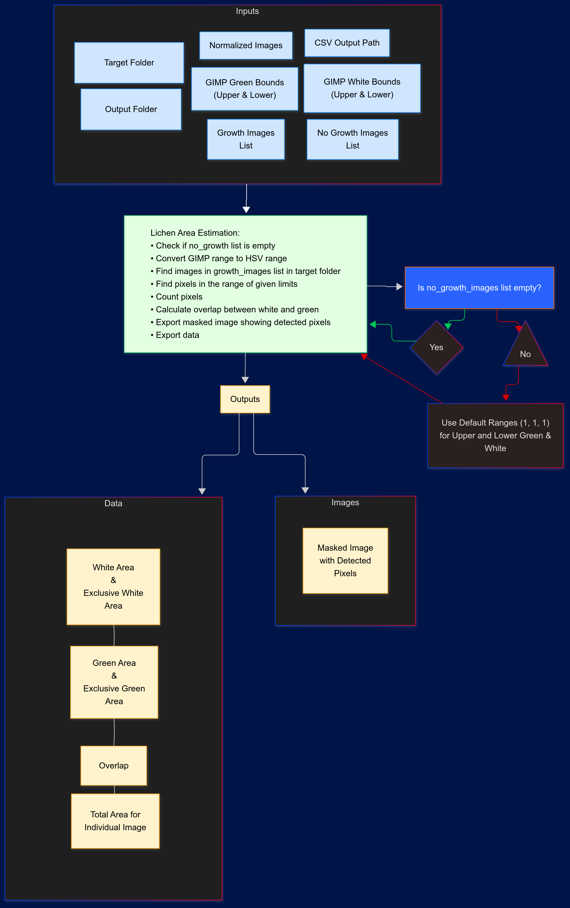
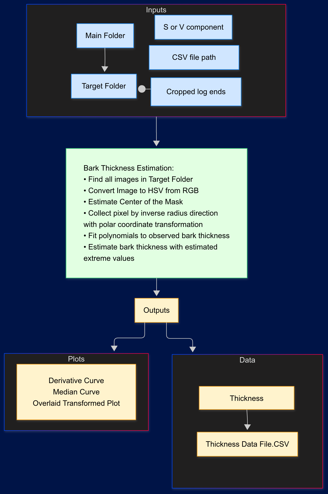

# Method for Lichen Cover and Bark Thickness Estimation

This is a still on going project. Purpose of this project is to extract data from photographs to be used in further anaylsis.
I work with University of Jyväskylä, Ecology and Environmental Sciences Department.

There are 4 main methods in this project:

* Crop images using Segment Anything Model by Meta
* Normalize images using background blanket
* Estimate lichen cover using HSV color space
* Estimate bark thickness

490 individual log images were processed. Each log had 6 images in different angles and positions.

Total images: 2940

## Preprocessing Image File Names

Images files were default names given by camera. Renaming was necessary for uniqueness, since default naming does not provide any information about the image and makes searching harder.

_DSCXXX was replaced by ID-XXX.

ID section tells individual tree log and its species. (ex. P1 for Pine 1) 
XXXX section identifies 6 images belongs to that tree log.

## Segment Anything Model (SAM) for Cropping

Model was used without any training. Images were given to algorithm and exported with transparency. Algorithm processes folders provided as list.

Each exported image was tagged with an index number for uniqueness.
Data recorded using file name as reference.

* Output:
    * Area
    * Top left x-y coordinate
    * Image with transparency 

Model captured any object in the image and their data. To clean the data set, regions of interest (ROI) were moved to new folder. Using file names, raw output data was cleaned using a Python script.

There were unexpected croppings, so model was run with different model sizes. Due to this, there were duplicate data.
Some of the duplicates cleaned by testing by overlaying cropped image onto original image using top left x-y coordinates and counting pixel area.

## Normalizing Images

Using background blanket, images that will be used in lichen estimation were normalized. This script was provided by my mentor during internship as Matlab script, which was translated to Python.

White blanket was used as standard for the normalizaton. Algorithm checks two folders, "blanket" and "cropped" using file names, uses blanket that belongs to the image to be normalized.

## Estimating Lichen Cover Using HSV Color Space

Most labor intensive step. Final approach for the most accurate estimation was using GIMP, pixel HSV color data collected by hand. There has been multiple iterations for this algorithm.

Method uses lower and upper range to find and count the pixels. Also HSV range converted from GIMP range to openCV.

1. Using a general range for lichen color.

   First tried to apply both tree species. But failed since, spruce can have white areas on the bark. Then tried separating range for each specie but this failed due to non-standard photography conditions. Such as, lighting, sun position, shade, sun shine.

2. Separate ranges for green/white pixels and overlap Issue

   Separating ranges were more accuarate but still could not be applied to both species. Also noticed green/white ranges were sometimes overlapping while recording ranges.

3. Process logs individually and account for overlap

   This was the most accurate approach. Using GIMP, pixel color data was collected from 4 different images of the logs, paying attention to capture all possible color variations. Also overlapping area was calculated using logic operation.

There were some logs that had no/negligible lichen. These logs were given as "no_growth_images" list. Their estimation forced to be "zero"

   In the end, exclusive green, exclusive white and overlap area summed to get total lichen area.

Method takes input/output folders and list of image names to be processed.

## Bark Thickness Estimation

Will be updated

